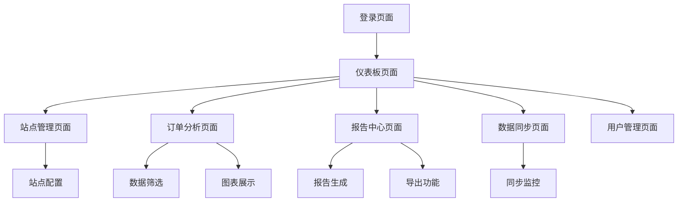

# WooCommerce多站点数据分析平台 - 产品需求文档

## 1. 产品概述

WooCommerce多站点数据分析平台是一个基于Web的订单数据管理和分析系统，专为管理多个WordPress/WooCommerce网站而设计。平台将现有的Python数据分析功能转换为用户友好的Web界面，提供实时数据同步、可视化分析和智能报告生成功能。

该平台解决了多站点电商运营者需要统一管理和分析各个网站订单数据的痛点，通过集中化的数据展示和分析，帮助用户做出更好的商业决策。

## 2. 核心功能

### 2.1 用户角色

| 角色 | 注册方式 | 核心权限 |
|------|----------|----------|
| 管理员 | 系统初始化创建 | 全部功能访问，用户管理，系统配置 |
| 站点管理员 | 管理员邀请 | 管理指定站点数据，查看分析报告 |
| 数据分析师 | 邮箱注册+审核 | 查看所有数据报告，导出分析结果 |

### 2.2 功能模块

我们的WooCommerce多站点数据分析平台包含以下主要页面：

1. **仪表板页面**：数据概览、关键指标展示、快速操作入口
2. **站点管理页面**：WordPress站点配置、API密钥管理、同步状态监控
3. **订单分析页面**：订单状态分析、销售趋势图表、多维度数据筛选
4. **报告中心页面**：自动化报告生成、Excel导出、历史报告查看
5. **数据同步页面**：手动/自动同步配置、同步日志、错误处理
6. **用户管理页面**：用户权限管理、角色分配、操作日志

### 2.3 页面详情

| 页面名称 | 模块名称 | 功能描述 |
|----------|----------|----------|
| 仪表板页面 | 数据概览卡片 | 显示总销售额、订单数量、活跃站点数等关键指标 |
| 仪表板页面 | 趋势图表 | 展示近30天销售趋势、订单状态分布饼图 |
| 仪表板页面 | 快速操作 | 一键同步数据、生成报告、查看异常站点 |
| 站点管理页面 | 站点列表 | 显示所有WordPress站点，包括状态、最后同步时间 |
| 站点管理页面 | 站点配置 | 添加/编辑站点信息、API密钥配置、同步设置 |
| 站点管理页面 | 连接测试 | 测试WooCommerce API连接状态、权限验证 |
| 订单分析页面 | 数据筛选器 | 按时间范围、站点、订单状态、金额范围筛选 |
| 订单分析页面 | 订单列表 | 分页显示订单详情、支持排序和搜索 |
| 订单分析页面 | 统计图表 | 销售趋势线图、订单状态分布、产品销量排行 |
| 报告中心页面 | 报告模板 | 预设报告模板：月度销售、产品分析、客户分析 |
| 报告中心页面 | 自定义报告 | 用户自定义报告参数、字段选择、格式设置 |
| 报告中心页面 | 导出功能 | 支持Excel、CSV、PDF格式导出，邮件发送 |
| 数据同步页面 | 同步配置 | 设置自动同步频率、增量/全量同步选择 |
| 数据同步页面 | 同步监控 | 实时显示同步进度、成功/失败状态 |
| 数据同步页面 | 错误处理 | 显示同步错误日志、重试机制、异常通知 |
| 用户管理页面 | 用户列表 | 显示所有用户、角色、最后登录时间 |
| 用户管理页面 | 权限管理 | 分配用户角色、设置站点访问权限 |
| 用户管理页面 | 操作日志 | 记录用户操作历史、数据变更追踪 |

## 3. 核心流程

**管理员流程**：
管理员登录系统 → 配置WordPress站点信息 → 设置API密钥 → 测试连接 → 启动数据同步 → 查看仪表板数据 → 生成分析报告

**站点管理员流程**：
站点管理员登录 → 查看指定站点数据 → 分析订单趋势 → 生成站点报告 → 导出数据

**数据分析师流程**：
分析师登录 → 选择分析维度 → 筛选数据范围 → 查看可视化图表 → 生成自定义报告 → 导出分析结果

## 4. 用户界面设计

### 4.1 设计风格

- **主色调**：#2563eb (蓝色) 和 #f8fafc (浅灰)
- **辅助色**：#10b981 (绿色成功)、#ef4444 (红色警告)、#f59e0b (橙色提醒)
- **按钮样式**：圆角按钮，悬停效果，阴影设计
- **字体**：Inter字体，标题16-24px，正文14px
- **布局风格**：卡片式布局，左侧导航栏，响应式设计
- **图标风格**：Heroicons线性图标，简洁现代

### 4.2 页面设计概览

| 页面名称 | 模块名称 | UI元素 |
|----------|----------|---------|
| 仪表板页面 | 数据概览卡片 | 白色卡片背景，彩色数字显示，趋势箭头图标，阴影效果 |
| 仪表板页面 | 趋势图表 | Chart.js图表库，蓝色主题，交互式图例，响应式布局 |
| 站点管理页面 | 站点列表 | 表格布局，状态指示灯，操作按钮组，分页控件 |
| 站点管理页面 | 站点配置 | 模态框表单，输入验证，保存/取消按钮，连接测试按钮 |
| 订单分析页面 | 数据筛选器 | 下拉选择器，日期选择器，搜索框，重置按钮 |
| 订单分析页面 | 统计图表 | 多类型图表，颜色编码，图例说明，全屏查看 |
| 报告中心页面 | 报告模板 | 卡片式模板选择，预览缩略图，一键生成按钮 |
| 数据同步页面 | 同步监控 | 进度条，状态标签，实时更新，日志滚动显示 |

### 4.3 响应式设计

桌面优先设计，支持平板和手机端适配。移动端采用底部导航栏，图表自动缩放，表格支持横向滚动。