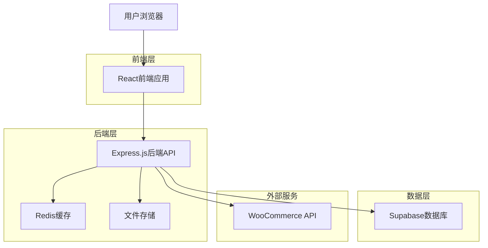
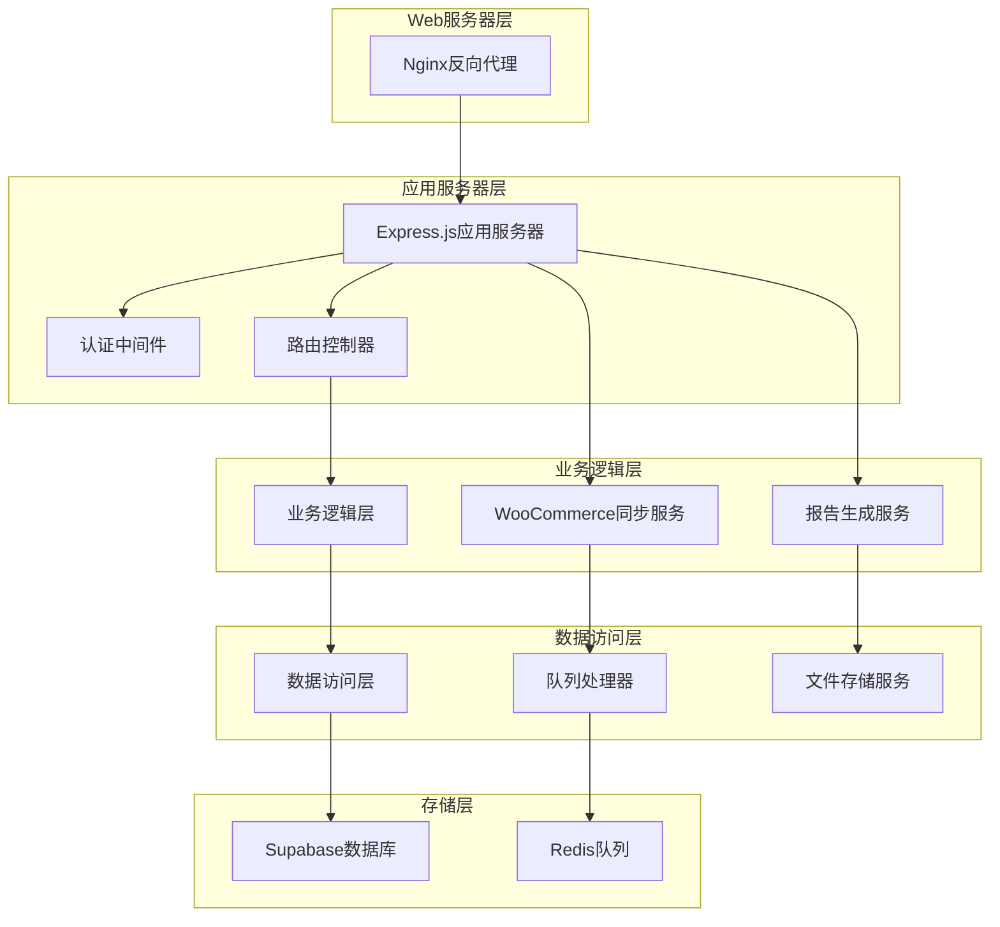
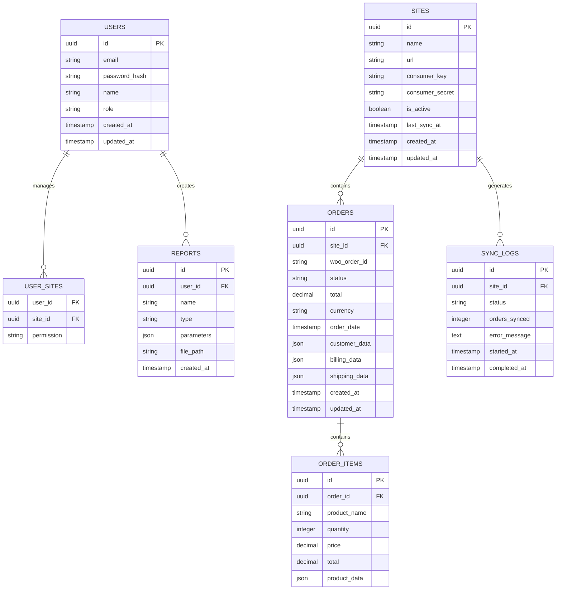

# WooCommerce多站点数据分析平台 - 技术架构文档

## 1. 架构设计



## 2. 技术描述

* 前端：React\@18 + TypeScript + Tailwind CSS + Vite + React Router + React Query

* 后端：Express.js\@4 + TypeScript + Node.js\@18

* 数据库：Supabase (PostgreSQL)

* 缓存：Redis\@7

* 文件存储：本地文件系统/云存储

* 部署：Docker + Nginx

## 3. 路由定义

| 路由         | 用途                     |
| ---------- | ---------------------- |
| /          | 重定向到仪表板                |
| /login     | 用户登录页面                 |
| /dashboard | 仪表板页面，显示数据概览和关键指标      |
| /sites     | 站点管理页面，管理WordPress站点配置 |
| /sites/:id | 单个站点详情页面               |
| /orders    | 订单分析页面，显示订单数据和分析图表     |
| /reports   | 报告中心页面，生成和管理分析报告       |
| /sync      | 数据同步页面，监控同步状态和配置       |
| /users     | 用户管理页面，管理用户权限和角色       |
| /settings  | 系统设置页面，配置全局参数          |

## 4. API定义

### 4.1 核心API

**用户认证相关**

```
POST /api/auth/login
```

请求参数：

| 参数名称     | 参数类型   | 是否必需 | 描述   |
| -------- | ------ | ---- | ---- |
| email    | string | true | 用户邮箱 |
| password | string | true | 用户密码 |

响应参数：

| 参数名称    | 参数类型    | 描述      |
| ------- | ------- | ------- |
| success | boolean | 登录是否成功  |
| token   | string  | JWT访问令牌 |
| user    | object  | 用户信息对象  |

示例：

```json
{
  "email": "admin@example.com",
  "password": "password123"
}
```

**站点管理相关**

```
GET /api/sites
POST /api/sites
PUT /api/sites/:id
DELETE /api/sites/:id
POST /api/sites/:id/test-connection
```

**订单数据相关**

```
GET /api/orders
GET /api/orders/stats
POST /api/orders/sync
GET /api/orders/export
```

**报告生成相关**

```
GET /api/reports
POST /api/reports/generate
GET /api/reports/:id/download
```

**数据同步相关**

```
GET /api/sync/status
POST /api/sync/start
POST /api/sync/stop
GET /api/sync/logs
```

## 5. 服务器架构图



## 6. 数据模型

### 6.1 数据模型定义



### 6.2 数据定义语言

**用户表 (users)**

```sql
-- 创建用户表
CREATE TABLE users (
    id UUID PRIMARY KEY DEFAULT gen_random_uuid(),
    email VARCHAR(255) UNIQUE NOT NULL,
    password_hash VARCHAR(255) NOT NULL,
    name VARCHAR(100) NOT NULL,
    role VARCHAR(20) DEFAULT 'user' CHECK (role IN ('admin', 'site_manager', 'analyst')),
    is_active BOOLEAN DEFAULT true,
    created_at TIMESTAMP WITH TIME ZONE DEFAULT NOW(),
    updated_at TIMESTAMP WITH TIME ZONE DEFAULT NOW()
);

-- 创建索引
CREATE INDEX idx_users_email ON users(email);
CREATE INDEX idx_users_role ON users(role);

-- 初始化管理员用户
INSERT INTO users (email, password_hash, name, role) VALUES 
('admin@example.com', '$2b$10$hashedpassword', '系统管理员', 'admin');
```

**站点表 (sites)**

```sql
-- 创建站点表
CREATE TABLE sites (
    id UUID PRIMARY KEY DEFAULT gen_random_uuid(),
    name VARCHAR(100) NOT NULL,
    url VARCHAR(255) NOT NULL,
    consumer_key VARCHAR(255) NOT NULL,
    consumer_secret VARCHAR(255) NOT NULL,
    is_active BOOLEAN DEFAULT true,
    last_sync_at TIMESTAMP WITH TIME ZONE,
    sync_frequency INTEGER DEFAULT 3600, -- 同步频率（秒）
    created_at TIMESTAMP WITH TIME ZONE DEFAULT NOW(),
    updated_at TIMESTAMP WITH TIME ZONE DEFAULT NOW()
);

-- 创建索引
CREATE INDEX idx_sites_url ON sites(url);
CREATE INDEX idx_sites_active ON sites(is_active);
CREATE INDEX idx_sites_last_sync ON sites(last_sync_at);
```

**订单表 (orders)**

```sql
-- 创建订单表
CREATE TABLE orders (
    id UUID PRIMARY KEY DEFAULT gen_random_uuid(),
    site_id UUID NOT NULL REFERENCES sites(id) ON DELETE CASCADE,
    woo_order_id VARCHAR(50) NOT NULL,
    order_number VARCHAR(50),
    status VARCHAR(50) NOT NULL,
    total DECIMAL(10,2) NOT NULL,
    currency VARCHAR(3) DEFAULT 'USD',
    order_date TIMESTAMP WITH TIME ZONE NOT NULL,
    customer_data JSONB,
    billing_data JSONB,
    shipping_data JSONB,
    payment_method VARCHAR(100),
    raw_data JSONB, -- 存储完整的WooCommerce订单数据
    created_at TIMESTAMP WITH TIME ZONE DEFAULT NOW(),
    updated_at TIMESTAMP WITH TIME ZONE DEFAULT NOW(),
    UNIQUE(site_id, woo_order_id)
);

-- 创建索引
CREATE INDEX idx_orders_site_id ON orders(site_id);
CREATE INDEX idx_orders_status ON orders(status);
CREATE INDEX idx_orders_order_date ON orders(order_date DESC);
CREATE INDEX idx_orders_total ON orders(total);
CREATE INDEX idx_orders_woo_id ON orders(woo_order_id);
```

**订单项目表 (order\_items)**

```sql
-- 创建订单项目表
CREATE TABLE order_items (
    id UUID PRIMARY KEY DEFAULT gen_random_uuid(),
    order_id UUID NOT NULL REFERENCES orders(id) ON DELETE CASCADE,
    product_id VARCHAR(50),
    product_name VARCHAR(255) NOT NULL,
    quantity INTEGER NOT NULL DEFAULT 1,
    price DECIMAL(10,2) NOT NULL,
    total DECIMAL(10,2) NOT NULL,
    product_data JSONB,
    created_at TIMESTAMP WITH TIME ZONE DEFAULT NOW()
);

-- 创建索引
CREATE INDEX idx_order_items_order_id ON order_items(order_id);
CREATE INDEX idx_order_items_product_id ON order_items(product_id);
CREATE INDEX idx_order_items_product_name ON order_items(product_name);
```

**同步日志表 (sync\_logs)**

```sql
-- 创建同步日志表
CREATE TABLE sync_logs (
    id UUID PRIMARY KEY DEFAULT gen_random_uuid(),
    site_id UUID NOT NULL REFERENCES sites(id) ON DELETE CASCADE,
    status VARCHAR(20) NOT NULL CHECK (status IN ('running', 'completed', 'failed')),
    orders_synced INTEGER DEFAULT 0,
    orders_updated INTEGER DEFAULT 0,
    orders_new INTEGER DEFAULT 0,
    error_message TEXT,
    started_at TIMESTAMP WITH TIME ZONE DEFAULT NOW(),
    completed_at TIMESTAMP WITH TIME ZONE
);

-- 创建索引
CREATE INDEX idx_sync_logs_site_id ON sync_logs(site_id);
CREATE INDEX idx_sync_logs_status ON sync_logs(status);
CREATE INDEX idx_sync_logs_started_at ON sync_logs(started_at DESC);
```

**报告表 (reports)**

```sql
-- 创建报告表
CREATE TABLE reports (
    id UUID PRIMARY KEY DEFAULT gen_random_uuid(),
    user_id UUID NOT NULL REFERENCES users(id) ON DELETE CASCADE,
    name VARCHAR(255) NOT NULL,
    type VARCHAR(50) NOT NULL,
    parameters JSONB NOT NULL,
    file_path VARCHAR(500),
    file_size INTEGER,
    status VARCHAR(20) DEFAULT 'pending' CHECK (status IN ('pending', 'generating', 'completed', 'failed')),
    created_at TIMESTAMP WITH TIME ZONE DEFAULT NOW(),
    completed_at TIMESTAMP WITH TIME ZONE
);

-- 创建索引
CREATE INDEX idx_reports_user_id ON reports(user_id);
CREATE INDEX idx_reports_type ON reports(type);
CREATE INDEX idx_reports_status ON reports(status);
CREATE INDEX idx_reports_created_at ON reports(created_at DESC);
```

**用户站点权限表 (user\_sites)**

```sql
-- 创建用户站点权限表
CREATE TABLE user_sites (
    user_id UUID NOT NULL REFERENCES users(id) ON DELETE CASCADE,
    site_id UUID NOT NULL REFERENCES sites(id) ON DELETE CASCADE,
    permission VARCHAR(20) DEFAULT 'read' CHECK (permission IN ('read', 'write', 'admin')),
    created_at TIMESTAMP WITH TIME ZONE DEFAULT NOW(),
    PRIMARY KEY (user_id, site_id)
);

-- 创建索引
CREATE INDEX idx_user_sites_user_id ON user_sites(user_id);
CREATE INDEX idx_user_sites_site_id ON user_sites(site_id);
```

**Supabase权限设置**

```sql
-- 为匿名用户授予基本读取权限
GRANT SELECT ON users TO anon;
GRANT SELECT ON sites TO anon;

-- 为认证用户授予完整权限
GRANT ALL PRIVILEGES ON users TO authenticated;
GRANT ALL PRIVILEGES ON sites TO authenticated;
GRANT ALL PRIVILEGES ON orders TO authenticated;
GRANT ALL PRIVILEGES ON order_items TO authenticated;
GRANT ALL PRIVILEGES ON sync_logs TO authenticated;
GRANT ALL PRIVILEGES ON reports TO authenticated;
GRANT ALL PRIVILEGES ON user_sites TO authenticated;
```

