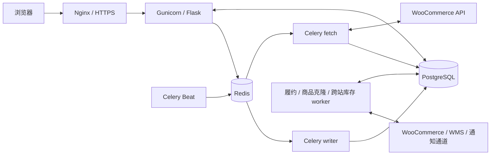

# Woo Analysis · 订单、库存与履约系统

Woo Analysis 是面向多个 WooCommerce 站点的内部运营系统，集中处理订单同步、人工发货、多仓履约、库存作业、商品管理、物流结果、退件损失和合伙人对账。

**文档核对日期：2026-09-18。** 当前生产使用 **PostgreSQL 17 + Redis + Celery + Flask/Gunicorn**。发布以 GitHub `main` 的具体提交为准；历史目录中的 SQLite 文件和旧工作树不代表当前生产版本。

[主要功能](#主要功能) · [系统架构](#系统架构) · [本地开发与测试](#本地开发与测试) · [配置](#配置) · [发布与运维](#发布与运维) · [文档索引](#文档索引)

## 主要功能

| 模块与入口 | 当前能力 |
| --- | --- |
| 订单列表、月度统计、数据报表 | 多站点订单镜像、筛选和分页、商品及客户分析、按月份和币种核算 |
| 系统设置 → 站点与同步 | 快速、定时及深度同步；持久化任务、进度、取消、恢复和日志；按站点检查 API 读取能力 |
| 发货管理 | 运单录入、承运商、分批发货、补发、重复运单校验、物流查询、待处理原因与结果核对 |
| 多仓履约 | 订单行分仓、库存预留、缺货、联合发货、包裹跟踪及订单终态聚合 |
| 库存管理 → 补货 / 调拨 / 盘点 | 分批实收、破损与少收登记、仓间在途、审核入账、盘点快照校验和库存流水 |
| 系统设置 → 临时库存修改授权 | 按人员、仓库、有效期授予临时盘点入账权限，保留授权与修改审计 |
| 产品管理 | 商品与变体读取、批量修改后回读、后台克隆、Master 站点关联 |
| 产品管理 → 跨站库存同步 | 目录读取进度、映射建议、库存差异预览、确认执行、后台任务和结果回读 |
| 数量库存自动推送 | 每站独立开关、观察 / 正式 / 自动暂停模式、共享库存分配及异常归零保护 |
| 系统设置 → 退件运费损失 | 按发货仓库、收货国家和币种配置正向与逆向运费，统一用于退件确认 |
| 合伙人对账、销售看板、成本管理 | COD、成本、退件损失、分成及对账单生成时快照 |
| 群通知、邮件中心接口 | 私有订单图片预览与通知路由；令牌保护的最小字段订单查询 |

WMS、通知发送和库存写入均有各自的配置与权限。代码中存在适配器，不表示某个仓库或外部通道已完成生产联调。

### 退件运费损失

在“系统设置 → 退件运费损失”中，每条规则包含发货仓库、两位国家代码、三位币种代码、正向运费和逆向运费。选择“所有仓库”可设置该区域的通用规则。

例如，捷克订单使用 `CZ / CZK`，正向 `200`、逆向 `200`，每单退件损失为 **400 CZK**。这是可修改的规则，不是代码中的固定金额。

- 同一区域优先匹配实际发货仓库的专用规则，其次使用区域通用规则。
- 手动、批量及自动退件确认共用规则；手动操作可以填写实际损失，包含实际为零的情况。
- 未匹配规则时通常沿用订单运费；存在仓库专用规则但无法确认仓库、多仓发货或规则币种与订单不一致时，要求人工核定。
- 保存规则影响后续退件确认，不会自动重算历史订单或已生成对账单。历史修正需要单独核对订单、快照及审计。
- 并发修改规则时检查版本，避免后一次保存覆盖他人的新配置。

实现：[return_shipping_loss.py](return_shipping_loss.py)。

### 发货结果核对与自动确认

发货请求超时或返回不明确时，系统保留操作记录及待核对状态。后台按原站点、订单、运单、承运商、商品身份和数量读取 WooCommerce 结果；证据一致后，原子补齐本地记录。核对本身不重发运单、不发送客户邮件、不调整库存。

Celery 每 60 秒扫描一次，首次核对至少等待 5 分钟；后续按退避间隔重查。证据不足、退件、补发、部分发货等冲突场景保留“需处理”，不会把未知结果当作成功。被明确拒绝的发货保留单独的原包裹人工重试流程。

物流结果还用于签收及退件自动确认。部分包裹签收、人工暂停、缺货或相互冲突的状态不能直接聚合为整单完成。详见 [发货结果核对](docs/shipment-reconciliation.md)。

### 商品克隆与库存映射

商品克隆由独立 worker 执行并逐件保存进度。“作为全新商品克隆”为父商品及变体生成任务专属 SKU；同一任务重试复用已创建的 SKU，普通克隆仍可以跳过已有商品。后台中断的任务保留中断状态，不盲目重建商品。

跨站库存同步中的“补齐商品映射”根据 SKU、条码、商品分类、名称和变体属性给出建议。确认映射需要权限、明确选择和操作原因；冲突或多个候选保留人工核对。保存映射不会直接修改网站库存，需要重新预览并确认库存变更。详见 [商品映射建议](docs/stock-sync-mapping-assist.md)。

### 仓库与权限边界

- 波兰人工合作仓与本地数量仓采用不同库存规则；有限库存中转仓不能按无限库存处理。
- 联合发货可以共用一个物理包裹，但各仓仍分别承担履约和库存责任。
- 在订单详情选择“已取消”，可一次停止各仓尚未发货、未提交外部仓的履约并释放预留库存，无需逐仓取消。系统先核对网站状态；已有发货、运单或外仓结果待核验时会提示具体处理方式，并保留仓库权限检查。
- “取消履约”只停止该仓作业，不等于取消网站订单。整单取消以网站回读确认为准；请求超时后再次点击只核对未确认结果，避免重复取消和重复释放库存。
- 内置 `admin` 可在履约详情点击“快速调整库存”，按当前仓库的订单商品填写实盘总数和原因，立即生成已入账盘点单。入口包括已映射但尚未分配的缺货商品；外部仓及非本地数量库存不支持。普通库存管理员和临时授权人员不能使用此快捷入口。
- 多仓履约列表和详情显示当前分仓中的缺货明细，包括完全未分配的商品；快捷盘点将缺货商品置顶标红。库存入账成功不等于整单缺货已解除，调整其他 SKU 不会补足缺货 SKU，保存后会显示仍缺的商品并提供刷新入口。
- 正常收货、调拨和盘点遵循提交与审核流程；临时授权的自动盘点入账保留独立授权依据。
- 补货入账后可通过持久化任务重新检查缺货订单的分配条件，仍需重新验证人工暂停、发货状态、库存和路由。
- 权限同时作用于页面和 API，结合角色、站点 / 市场、仓库及操作类型判断。只读参照站权限不会变成库存或商品写权限。

详见 [库存作业流程](INVENTORY_OPERATIONS.md) 和 [多仓履约规则](MULTI_WAREHOUSE_FULFILLMENT.md)。

## 系统架构



PostgreSQL 保存业务状态、任务进度、操作记录及待投递消息；Redis 负责传递任务，不是业务状态的唯一来源。订单同步通过 `sync_runs`、分页记录和 outbox 恢复执行。fetch 队列执行网络读取及核对，writer 队列串行处理同步页面入库等任务；其他后台模块保留各自的持久化任务。

核心履约关系为 `Order → OrderItem → FulfillmentItem → Fulfillment → Shipment → TrackingEvent`。订单是商业记录，履约单表示仓库责任，包裹表示物理发货；多仓或分批发货不会凭空生成新的客户订单。

### 服务与运行环境

当前生产目录为 `/www/wwwroot/woo-analysis`。2026-09-18 核验的运行版本为 Python **3.12.3**、PostgreSQL **17.11**；补丁版本会随维护升级。

| systemd 单元 | 职责 |
| --- | --- |
| `woo-analysis` | Gunicorn Web 服务，源站监听 `127.0.0.1:5000` |
| `woo-celery-fetch` | `sync_fetch` 队列；当前模板并发 3 |
| `woo-celery-write` | `sync_write` 队列；当前模板并发 1 |
| `woo-celery-beat` | 单实例定时调度、恢复扫描和结果核对扫描 |
| `woo-fulfillment-worker` | 多仓履约后台作业 |
| `woo-product-clone-worker` | 商品克隆队列 |
| `woo-stock-sync-worker` | 跨站库存目录、映射、预览和执行任务 |
| `woo-postgres-backup.timer` | 每小时触发 PostgreSQL 在线备份 |
| `woo-drive-backup.timer` / `woo-drive-backup-health.timer` | Google Drive 日备份、上传校验及失败邮件检查 |

独立 worker 的 unit 位于 [deploy/](deploy/)，Celery、备份 unit 和 PostgreSQL drop-in 位于 [deploy/systemd/](deploy/systemd/)。Gunicorn 的基础 unit 由主机管理，仓库提供相关 drop-in；不要把模板目录当成所有主机配置的完整副本。

### 代码导航

| 文件 / 目录 | 作用 |
| --- | --- |
| [app.py](app.py)、[templates/](templates/)、[static/](static/) | Web 路由、页面与前端交互 |
| [db_backend.py](db_backend.py)、[migrations/postgresql/](migrations/postgresql/) | PostgreSQL 连接池、兼容层与迁移 |
| [sync_service.py](sync_service.py)、[sync_tasks.py](sync_tasks.py)、[celery_app.py](celery_app.py) | 持久化同步、队列与调度 |
| [external_operations.py](external_operations.py)、[shipment_reconciliation.py](shipment_reconciliation.py)、[shipment_retry.py](shipment_retry.py) | 外部操作记录、发货核对及受控重试 |
| [auto_confirm.py](auto_confirm.py)、[delivery_automation.py](delivery_automation.py)、[carrier_outcome_bridge.py](carrier_outcome_bridge.py) | 物流结果关联与自动确认 |
| [fulfillment_service.py](fulfillment_service.py)、[fulfillment_worker.py](fulfillment_worker.py) | 分仓、预留、包裹及任务执行 |
| `inv_*.py`、[inventory_replan.py](inventory_replan.py) | 库存、映射、作业审批、台账及补货重算 |
| `stock_sync_*.py`、[stock_sync_worker.py](stock_sync_worker.py) | 跨站库存同步与映射辅助 |
| `product_clone_*.py`、[product_manager_service.py](product_manager_service.py) | 商品克隆、SKU 和修改回读 |
| [return_shipping_loss.py](return_shipping_loss.py) | 按仓库 / 区域计算退件运费损失 |
| `order_notification_*.py`、[mail_center_readonly_api.py](mail_center_readonly_api.py) | 通知、渲染及受限订单查询 |
| [backup_db.py](backup_db.py)、[tests/](tests/) | 备份校验与回归验证 |

## 本地开发与测试

### 获取代码与安装依赖

日常主目录约定为 `woo-analysis-main`。已有该目录时直接使用；新环境可按以下步骤克隆：

```bash
git clone https://github.com/Michaelwuhui/woocommerce-order-analysis.git woo-analysis-main
cd woo-analysis-main
```

建议使用与生产一致的 Python 3.12。完整服务在 Linux 运行；Windows 可用于代码编辑和离线测试。JavaScript 测试需要 Node.js，PostgreSQL 连接需要可用的 libpq，备份环境还需要匹配的 `pg_dump` / `pg_restore`。

Linux：

```bash
python3 -m venv .venv
source .venv/bin/activate
python -m pip install -r requirements.txt pytest
```

Windows PowerShell：

```powershell
py -3.12 -m venv .venv
.\.venv\Scripts\python.exe -m pip install -r requirements.txt pytest
```

依赖范围以 [requirements.txt](requirements.txt) 为准。需要订单图片渲染时，再安装 `python -m playwright install chromium`，并为运行主机准备中日韩字体。

新工作从最新 `origin/main` 创建 `codex/*` 分支。保留其他任务的改动和旧工作树，处理方式见 [代码统一记录](docs/code-consolidation-20260918.md)。

### 离线回归

Linux，在已激活的虚拟环境中：

```bash
WOO_DB_BACKEND=sqlite python -m pytest -q -p no:cacheprovider
node --test tests/site_api_checks.test.cjs
node tests/test_shipment_reconciliation_ui.js
```

Windows PowerShell：

```powershell
$env:WOO_DB_BACKEND = 'sqlite'
.\.venv\Scripts\python.exe -m pytest -q -p no:cacheprovider
node --test tests/site_api_checks.test.cjs
node tests/test_shipment_reconciliation_ui.js
```

[pytest.ini](pytest.ini) 只收集 `tests/`。仓库根目录保留部分历史诊断脚本，可能在导入时访问已配置的站点，不能将它们加入常规测试收集范围。

PostgreSQL、浏览器或性能专项会按条件跳过；离线通过不代表这些专项已通过。2026-09-18 统一基线曾验证 Linux 离线 **676 项通过 / 82 项跳过**，相关 PostgreSQL 集成 **51 项通过**，站点 API JavaScript **7 项通过**；这是该次验收记录，不是后续提交的实时测试结果。

### PostgreSQL 集成与完整开发服务

SQLite 仅用于离线兼容和部分单元测试。完整应用使用 PostgreSQL；导入 `app.py` 会检查迁移后的表，空目录中的 SQLite 文件不能替代数据库初始化。

1. 准备独立开发 / 测试库，按 [迁移与运行手册](deploy/POSTGRES_CELERY_OPERATIONS.md) 及本次功能的 schema 说明建立结构。仅验证接口时，可以复制生产表结构并填充合成数据，不复制业务行或生产凭据。
2. 将独立库的 `WOO_DB_BACKEND=postgres`、`WOO_DB_*`、开发用 `FLASK_SECRET_KEY` 注入进程环境。运行 worker 时使用独立 Redis，不与生产队列共享。
3. 按目标测试的库名前缀及 fixture 要求运行。退件、权限、发货重试、邮件接口的组合命令见 [统一记录中的验证步骤](docs/code-consolidation-20260918.md#可重复的验证)；发货核对使用 `woo_reconcile_test_`，库存作业使用 `woo_inventory_test_` 专项库。不要将整个测试集直接指向生产库。
4. 需要页面开发时，在已完成上述准备的环境中启动仅监听本机的服务：

```bash
python -m flask --app app run --host 127.0.0.1 --port 5000
```

需要验证后台流程时，再在独立终端启动对应 worker。不要使用仓库默认的 `python app.py` 作为生产启动方式；其入口启用了 debug 并监听所有网卡。仓库未提供可直接用于生产的新租户一键初始化流程。

## 配置

生产 Web 和相关 worker 使用仓库外的受保护配置，主配置为 `/etc/woo-analysis/woo-analysis.env`。配置文件及真实凭据不提交到 Git。本地开发需主动把所需值注入进程环境；不要假定存在自动加载全部 `.env` 文件的逻辑。

| 配置 | 用途 |
| --- | --- |
| `WOO_DB_BACKEND=postgres`、`WOO_DB_HOST/PORT/NAME/USER/PASSWORD` | PostgreSQL 业务连接 |
| `WOO_DB_POOL_*`、`WOO_DB_CONNECT_TIMEOUT` | 进程连接预算与超时；开发测试并发须独立核算 |
| `FLASK_SECRET_KEY` | Web 会话签名密钥 |
| `CELERY_BROKER_URL` | 本环境的 Redis broker；兼容变量 `WOO_CELERY_BROKER_URL` 若同时设置，值应相同 |
| `WOO_SYNC_*` | 同步超时、IPv4、心跳、恢复与提交后动作 |
| `STOCK_SYNC_ENABLED` | 跨站库存同步功能开关，Web 与 worker 保持一致 |
| `WOO_BACKUP_DIR`、`WOO_BACKUP_KEEP_LOCAL`、`WOO_BACKUP_OFFSITE_CONFIG` | 备份目录、保留策略与异地配置 |
| `MAIL_CENTER_ORDER_API_TOKEN_FILE`、`MAIL_CENTER_ORDER_ALLOWED_SITES`、`MAIL_CENTER_ORDER_PUBLIC_BASE_URL` | 邮件中心专用令牌、站点白名单与订单链接 |
| `ORDER_NOTIFICATION_*` | 通知事件认证、私有图片目录、渲染与密钥引用 |
| `WMS_*`、`SZ56T_*` | 匈牙利 / 新波兰 WMS 的独立连接与认证 |

`MAIL_CENTER_ORDER_DB_PATH`、`WOO_SQLITE_PATH` 等 SQLite 路径不决定当前生产 PostgreSQL 数据源。生产应用账号使用限定权限，建表和 schema 升级由维护流程执行。

可复制的非秘密模板：[主配置](deploy/woo-analysis.env.example)、[跨站库存](deploy/stock-sync.env.example)、[履约](deploy/fulfillment.env.example)、[订单通知](deploy/order-notification.env.example)、[邮件中心](deploy/mail-center-readonly.env.example)。

## 发布与运维

### 常规发布

1. 核对本地分支、GitHub `main`、生产 HEAD 和工作区状态；先保存并识别已有差异。
2. 只提交本次改动，执行与改动对应的检查，经 PR 合并。文档修改检查内容与链接，业务修改增加相应单元、数据库或页面验收。
3. 发布前保留代码、配置和数据库备份。生产目录快进到经过验证的固定合并提交，核对实际文件。
4. 根据影响更新运行进程：Web 代码使用已配置的平滑重载；独立 worker 需在确认任务状态后更新；Beat 保持单实例。修改 schema 时另外执行对应迁移方案。
5. 检查服务、源站与登录后的页面 / API，回读本次功能涉及的数据和外部结果。记录部署提交与验收证据。

仅 README 等文档变化时，同步仓库即可，不需要重启业务服务。首次 SQLite → PostgreSQL 切换、数据库恢复和普通代码发布是不同流程；[生产切换手册](deploy/POSTGRES_CELERY_OPERATIONS.md) 中的重建数据库命令不能作为每次部署步骤。

当前主机的只读检查示例：

```bash
cd /www/wwwroot/woo-analysis
git status --short --branch
git rev-parse HEAD
systemctl is-active woo-analysis woo-celery-fetch woo-celery-write woo-celery-beat \
  woo-fulfillment-worker woo-product-clone-worker woo-stock-sync-worker
systemctl list-timers woo-postgres-backup.timer --no-pager
curl -fsS http://127.0.0.1:5000/login > /dev/null
```

源站 HTTP 成功只证明路由可响应，仍需验证登录态、权限及业务结果。

### 备份与恢复

[backup_db.py](backup_db.py) 在 PostgreSQL 模式下生成 `pg_dump` custom-format 的 `.dump`、SHA256 文件和备份清单；`woo-postgres-backup.timer` 按小时执行。默认本地目录为 `/www/backups/woo-orders`，实际保留和异地策略以配置及读取结果为准。

[backup_drive.py](backup_drive.py) 可将最近的已校验 PostgreSQL 备份、代码版本和运行配置打包，按日上传到私有 Google Drive 目录。上传支持限额退避、续传和云端内容校验；独立健康检查负责失败、超时及恢复邮件，状态在管理员系统设置中展示。启用方式及恢复边界见 [Google Drive 日备份](docs/google-drive-backup.md)。

对选定备份检查 SHA256 和 `pg_restore --list`，定期恢复到隔离库验证可用性。运行备份脚本时必须加载正确的 PostgreSQL 配置；旧 SQLite `.db.gz` 不能作为当前生产库备份。

回滚优先恢复兼容的已知代码版本。数据库恢复需要单独确认停写范围及新增业务数据的处置，不能简单用旧全库覆盖新订单。WooCommerce / WMS 已接受的操作和已发送通知不会随本地数据库回滚而撤销，应保留审计并对账处理。

### 常见问题

| 现象 | 优先检查 |
| --- | --- |
| 同步任务停滞或浏览器关闭后不更新 | `sync_runs`、outbox、fetch / writer / Beat 状态；区分排队、限流、鉴权失败和恢复中 |
| 接口收到 HTML 或 `Unexpected token '<'` | 登录会话、响应内容、代理 / WAF、Nginx 与 Gunicorn；不要反复提交有副作用的操作 |
| 运单已提交但显示“需处理” | 原操作记录、最近核对结果及 WooCommerce 原运单；使用现有核对 / 重试入口 |
| 有库存仍显示缺货 | 商品及仓库 SKU 映射、包装折算、现存与预留、供货来源、路由和人工暂停 |
| 跨站库存任务不推进 | `woo-stock-sync-worker`、功能开关、任务 / 租约、最新权限与映射；先核实外部结果再恢复 |
| 退件金额不符合预期 | 实际发货仓库、收货国家、规则优先级、币种和是否为已记录的历史实际金额 |
| 新克隆没有新增商品 | 克隆模式、任务结果的创建 / 跳过计数、目标 SKU；重试应保留同一任务身份 |

查看相关服务日志，例如 `journalctl -u woo-analysis -n 100 --no-pager` 或对应 worker 单元。Celery 文件日志位于 `/var/log/woo-analysis/`；日志和排查材料不应包含完整凭据或客户敏感数据。

## 已知边界

- `app.py` 仍包含较多历史兼容逻辑；新业务优先放入独立模块并覆盖关键状态转换。
- 网页端破坏性的“清理同步”在 PostgreSQL 模式下已停用，返回明确提示；不能按旧线程实现理解其行为。
- WMS 自动提交、群通知发送及库存写入需要各自的配置和业务验收，不由代码部署自动启用。
- 公司利润 Web 页面及相关 API 已下线。现有离线导出脚本仍按 SQLite 快照设计，不是当前 PostgreSQL 生产的直接导出入口；使用前需核对快照来源、数据时点并隔离运行环境。
- 历史操作手册可能保留当时的迁移步骤或配置状态。执行前以当前代码、数据库及服务配置核对，不能把历史上线清单当成实时状态。

## 文档索引

| 文档 | 阅读场景 |
| --- | --- |
| [PostgreSQL / Celery 生产手册](deploy/POSTGRES_CELERY_OPERATIONS.md) | 连接预算、迁移、systemd、备份及切换恢复 |
| [代码统一记录](docs/code-consolidation-20260918.md) | 历史分支归并、保留方式、2026-09-18 验证和集成测试命令 |
| [库存作业流程](INVENTORY_OPERATIONS.md) | 补货、收货、调拨、盘点和临时授权 |
| [库存模型](INVENTORY.md) | SKU、批次、仓库、映射和台账 |
| [多仓履约](MULTI_WAREHOUSE_FULFILLMENT.md) | 分仓、联合发货、状态、COD 与 WMS |
| [发货结果核对](docs/shipment-reconciliation.md) | 不明确发货结果、后台核对及重试边界 |
| [跨站商品映射建议](docs/stock-sync-mapping-assist.md) | 目录、候选、确认与库存预览 |
| [订单图片通知](ORDER_IMAGE_NOTIFICATIONS.md) | 私有预览、路由、发送与验收 |
| [历史离线利润导出说明](OFFLINE_COMPANY_PROFIT_EXPORT.md) | SQLite 离线流程与 Web 下线背景，注意上述数据源限制 |
| [新波兰仓事项](todo-new-poland-warehouse.md)、[WMS 上线事项](todo-wms-go-live.md) | 外部仓库联调背景；具体完成状态需重新核验 |

本项目为内部业务系统；许可、分发和对外部署范围由项目所有者另行确定。
